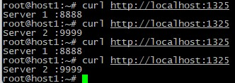
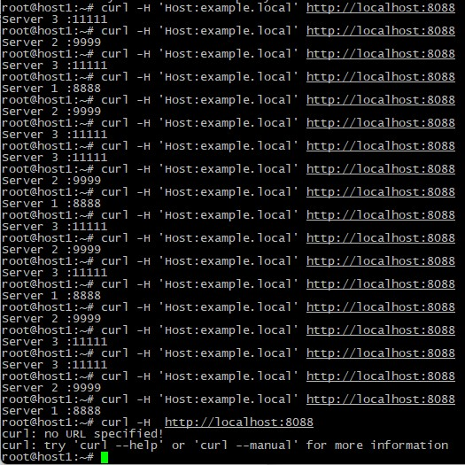

### Домашнее задание "Кластеризация и балансировка нагрузки" - Князев Евгений

## Задание 1
1. конфигурационный файл haproxy.cfg
[Config1.cfg](./configs/config1.cfg)

2. Скриншот - перенаправление запросов на разные серверы при обращении к HAProxy

## Задание 2
1. Конфигурационный файл haproxy.cfg
[Config2.cfg](./configs/config2.cfg)

2. Скриншот - перенаправление запросов на разные серверы при обращении к HAProxy c использованием домена example.local и без него
